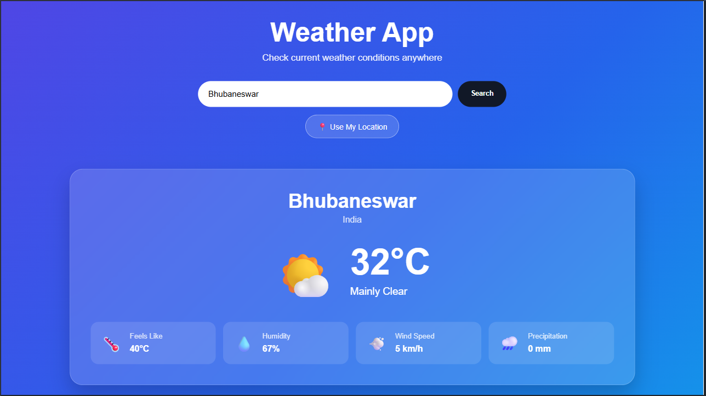
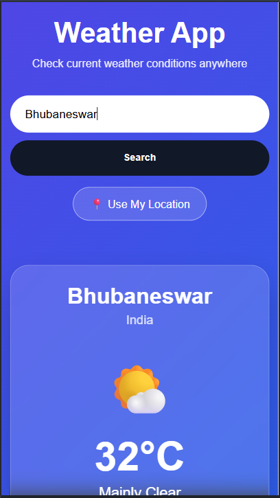
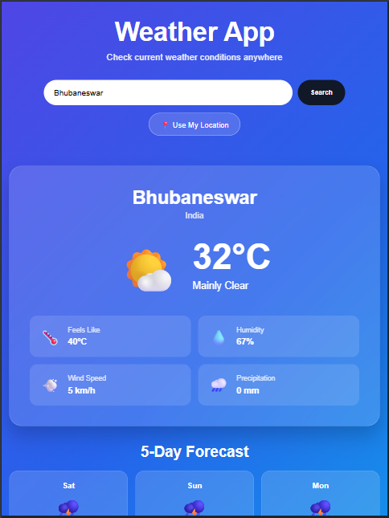

# 🌤️ PRODIGY_WD_05 - Weather App

A responsive and interactive Weather App developed as part of the **Web Development Internship at Prodigy InfoTech**.

The application allows users to search for current weather information by entering a city name or by using their current location. Weather data is fetched from a weather API and displayed in a simple, user-friendly interface.

---

## 🌐 Live Demo

[🔗 View Live Demo](https://ritika0117.github.io/PRODIGY_WD_05/)

---

## ✨ Features

- 🔍 Search weather by city name
- 📍 Get weather information using the user's current location
- 🌡️ Display current temperature
- ☁️ Display current weather conditions
- 📊 Display relevant weather information
- 📱 Responsive design for mobile, tablet, and desktop
- ⚡ Interactive user interface
- 🎨 Clean and modern design
- ❌ Displays an error message for invalid locations

---

## 🛠️ Technologies Used

- **HTML5** – Used to structure the web application
- **CSS3** – Used for styling and responsive design
- **JavaScript** – Used to add functionality and interactivity
- **Weather API** – Used to fetch real-time weather information
- **Git & GitHub** – Used for version control and project hosting

---

## 📸 Screenshots

### 💻 Desktop View



### 📱 Mobile View



### 📲 Tablet View



---

## 📂 Project Structure

```text
PRODIGY_WD_05/
│
├── index.html
├── style.css
├── script.js
├── README.md
│
└── screenshots/
    ├── desktop.png
    ├── mobile.png
    └── tablet.png